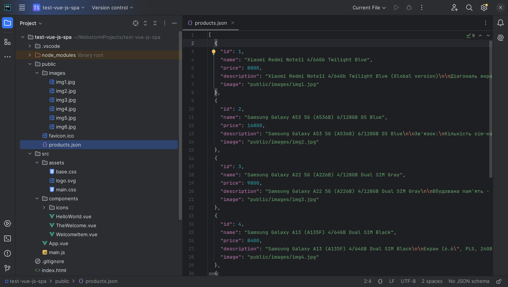
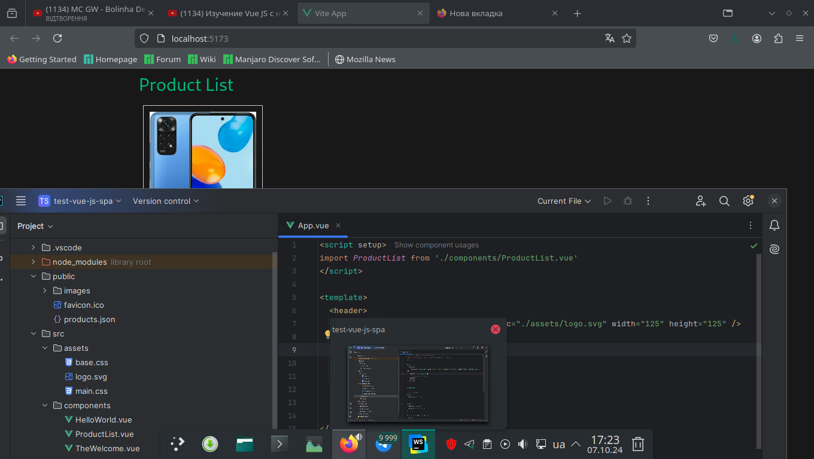
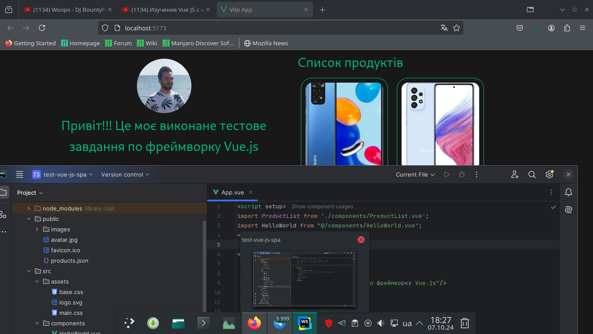
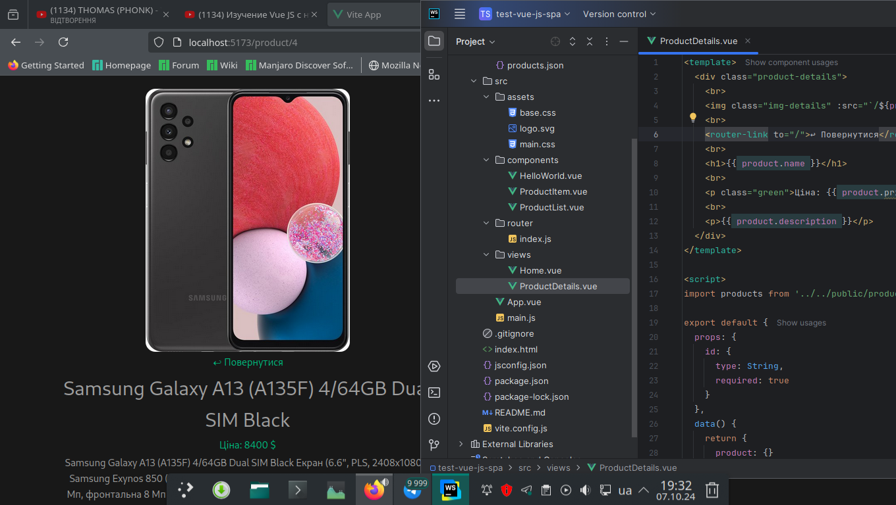
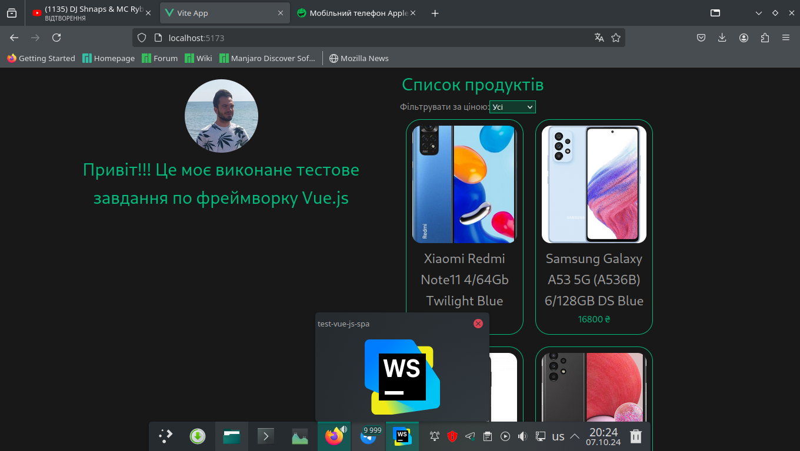

<p align="center"></p>
<h1 align="center">test-vue-js-spa</h1>

## Description
<b>EN:</b>

This website was created as a test task for one of the ***Middle Vue.js Developer*** positions.

The task sounded like this:

1. Create a simple SPA (Single Page Application) based on Vue.js that displays a list of products and allows the user to view the details of each product.

2. Requirements:
 - List of products:
   Create a JSON file with product information (name, price, description, image).
   Display a list of products as cards on the main page.
 - View product details:
   When clicking on the product card, the user should go to a separate page with detailed information about the product (name, price, description, large image).

3. Filtration of products:
Implement the ability to filter products by price (for example, the filter "cheap", "average", "expensive").

4. Navigation:
Implement navigation between the main page and the product details page using Vue Router.

5. Technical requirements:
Use Vue.js (version 3).
Use Axios (or similar) to get data from a local JSON file.
Use SFC (Single File Components) to structure the project.

6. Evaluation criteria:
Clear and clean code.
Ability to use the basic features of Vue.js.
Use of modern development tools and methods.
Logical structure of the project.

<b>UA:</b>

Це веб сайт створений як тестове завдання на одну з позицій ***Middle Vue.js Developer***.

Завдання звучало так:

1. Створити простий SPA (Single Page Application) на основі Vue.js, який відображає список продуктів і дозволяє користувачу переглядати деталі кожного продукту.
   
2. Вимоги:
  - Список продуктів:
    Створити JSON файл з інформацією про продукти (назва, ціна, опис, зображення).
    Показати список продуктів у вигляді карток на головній сторінці.
  - Перегляд деталей продукту:
    При натисканні на картку продукту користувач має переходити на окрему сторінку з детальною інформацією про продукт (назва, ціна, опис, велике зображення).

3. Фільтрація продуктів:
Реалізувати можливість фільтрації продуктів за ціною (наприклад, фільтр "дешеві", "середні", "дорогі").

4. Навігація:
Реалізувати навігацію між головною сторінкою і сторінкою деталей продукту за допомогою Vue Router.

5. Технічні вимоги:
Використати Vue.js (версія 3).
Використати Axios (або аналог) для отримання даних з локального JSON файлу.
Використати SFC (Single File Components) для структурування проекту.

6. Критерії оцінки:
Зрозумілий та чистий код.
Вміння використовувати основні можливості Vue.js.
Використання сучасних інструментів та методів розробки.
Логічна структура проекту.

#
## Screenshots
<p align="center">
  
  
  
  
  
</p>

#
## Technologies used
<b>EN:</b>
- Creating an application using the framework [**Vue.js**](https://vuejs.org/)
- Use of modern development tools and methods
- Using [SFC (Single File Components)](https://vuejs.org/guide/scaling-up/sfc.html) to structure the project
- Navigation using ***Vue Router***.
- Working with **JSON** format
- Data filtering

<b>UA:</b>
- Створення застосунку за допомогою фреймворку [**Vue.js**](https://vuejs.org/)
- Використання сучасних інструментів та методів розробки
- Використання [SFC (Single File Components)](https://vuejs.org/guide/scaling-up/sfc.html) для структурування проекту
- Навігація за допомогою ***Vue Router***.
- Робота з форматом **JSON**
- Фільтрація даних

#
## License
```
© 2024, CoolOtaku (ericspz531@gmail.com)
```

This template should help get you started developing with Vue 3 in Vite.

## Recommended IDE Setup

[VSCode](https://code.visualstudio.com/) + [Volar](https://marketplace.visualstudio.com/items?itemName=Vue.volar) (and disable Vetur).

## Customize configuration

See [Vite Configuration Reference](https://vitejs.dev/config/).

## Project Setup

```sh
npm install
```

### Compile and Hot-Reload for Development

```sh
npm run dev
```

### Compile and Minify for Production

```sh
npm run build
```
